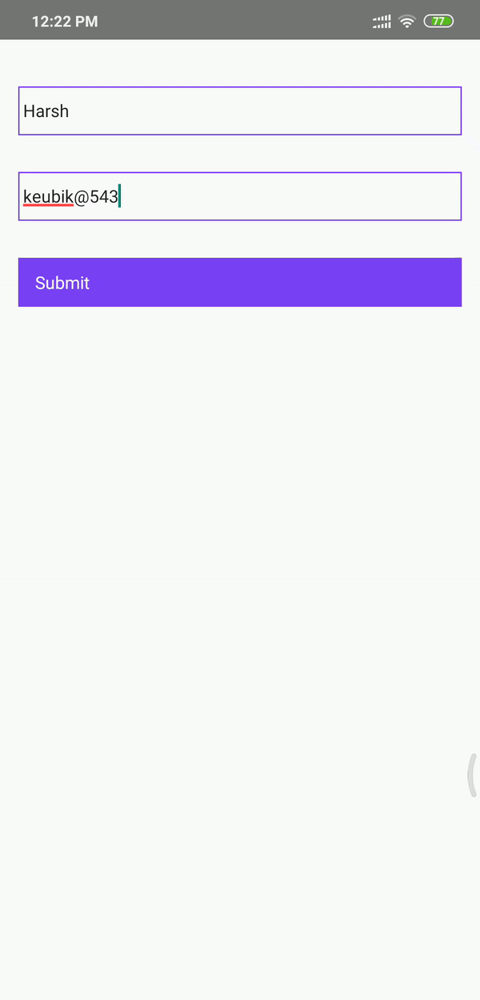

# react-native-to-native-communication
Communication between React Native and Native Android App Communication

## React-Native -> Native Android Communication

1.  Create ActivityStarterModule.java in your android app  
    ActivityStarter is just a Java class that implements a React Native Java interface called NativeModule.
    The heavy lifting of this interface is already done by BaseJavaModule, so one normally extends either
    that one or ReactContextBaseJavaModule

2.  Create a custom package which implements ReactPackage interface. This package will expose our custom module.
    One ReactPackage can expose any number of custom modules.

3.  Update MainApplication.java to include your newly created package in getPackages()

4.  Import 'NativeModules' from 'react-native' package in your javascript(.js) file.
    Use your ActivityStarterModule's method with the help of NativeModules package just imported.

## Post Implementation

## Reference -
https://github.com/petterh/react-native-android-activity
https://stackoverflow.com/questions/42253397/call-android-activity-from-react-native-code/43675819
